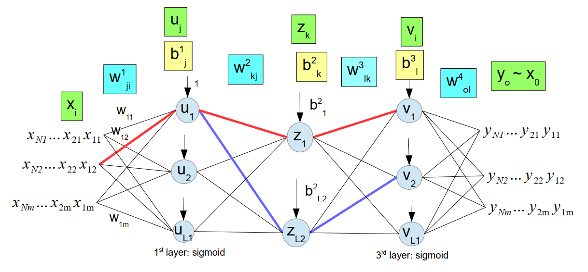

# Autoencoder
Python and NumPy implementation from scratch of autoencoder.

The training set with ***N*** elements is defined as ***D={X1, . . ., XN}***, where ***X*** is a vector.

Sample code at the end of the file.

The autoencoder encodes the input ***X*** into the lower dimension ***z***, and then decodes to ***y~x***. The autoencoder reduces the dimension of ***X*** while keeping the main features.

## Architecture



- 1st and 3rd layers: sigmoid
- 2nd and 4th layers: no activation function
- Cost function: MSE
- Equal number of neurons in 1st and 3rd layers
## Features
- Early stopping
- Variable gradient descent learning rate
- Momentum (set eta > 0 to enable)
- Update one layer weights individually, then all layers simultaneously
- Plot MSE vs iteration (uncomment to save plot)
- Derivatives computed in matrix notation and loop
## Usage
```
train(Xd, L1, L2, plot = True):
    Train autoencoder network.
    
    Input
        Xd:         matrix of values to encode
        L1:         number of 1st and 3rd layer neurons
        L2:         number of 2nd layer neurons
    Output
        weights:    object with weights and biases
        

encode(Xd, weights):
    Encode and decode Xd.
    
    Input
        Xd:         matrix of values to encode
        weights:    object with weights and biases
    Output:
        z:          enconded values of Xd
        y:          decoded values of z


decode(z, weights):
    Decode z.

    Input
        z:          matrix of values to decode
        weights:    object with weights and biases
    Output:
        y:          decoded values of z
```
## Backpropagation
Derivatives calculation available at:  
https://github.com/vivamoto/Classifier/blob/master/Neural_Network_Derivatives.pdf

Example code at the end of the file.

## Reference
Lecture from Prof Clodoaldo Lima

## Cite as
Victor Ivamoto. (2020, August 25). vivamoto/Classifier: First release. (Version v0.1.1-beta). Zenodo. http://doi.org/10.5281/zenodo.4001109

[](https://zenodo.org/badge/latestdoi/279084447)


