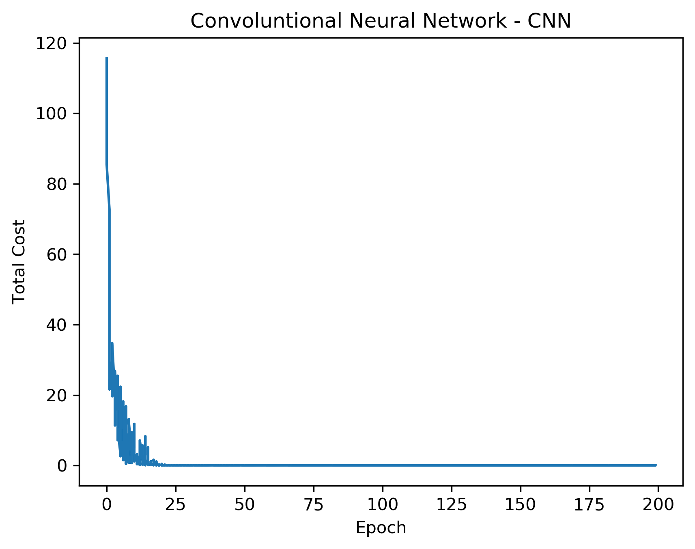

## Convulutional Neural Network (CNN)

Python and NumPy implementation from scratch of convolutional neural network (CNN).

Flexible architecture: setup the number of layers
- Convolution layer
- Pooling layer
- Full connected layer

Activation functions: relu and sigmoid
Output layer: softmax

Features:
- dropout
- regularization
- minibatch
- momentum

Example of usage in the end of code file.

Author: Lima, C. A. M.
Translated to Python by Ivamoto, V. - Ramos, W.
Translated to English: Ivamoto, V.

## Setup

Create the `opts` object with desired parameter values, then define as many convolution and pooling layers as you need. The last layer (full connected) definition is optional.

    opts = obj()              # initialize empty object
    opts.alpha = 1e-1         # learning rate
    opts.batchsize = 50       # training set size
    opts.numepochs = 200      # number of epochs
    opts.imageDimX = 28       # image X axis dimension
    opts.imageDimY = 28       # image Y axis dimension
    opts.imageCanal = 1       # number of channels in input image
    opts.numClasses = 10      # number of classes
    opts.lambda_ = 0.0001     # weight decay factor
    opts.ratio = 0.0          # weight freeze factor
    opts.momentum = 0.95      # final momentum factor
    opts.mom = 0.5            # initial momentum factor
    opts.momIncrease = 20     # number of epochs to change momentum


    # Convolution layer
    cnn.layers[0] = obj()
    cnn.layers[0].type = 'c'            # c = convolution
    cnn.layers[0].numFilters = 4        # number of filters
    cnn.layers[0].strider = 1           # strider
    cnn.layers[0].dimFiltros = 2        # filter size
    cnn.layers[0].fativ = 'relu'        # sig/relu: activation function
    
    # Pooling layer
    cnn.layers[1] = obj()
    cnn.layers[1].type = 'p'            # p = pooling
    cnn.layers[1].strider = 2           # strider
    cnn.layers[1].dimPool = 2           # filter size
    cnn.layers[1].criterio = 'max'      # max/mean

    # Full connected layer
    cnn.layers[2] = obj()              
    cnn.layers[2].type = 'f'           # f = full connected
    cnn.layers[2].fativ = 'sig'        # sig/relu: activation funciton
    cnn.layers[2].numhidden = 100      # number of neurons in hidden layer


## Usage

```
init_params(cnn,opts):
    Setup CNN based on network parameters.
    
    Args:
        cnn:    object with cnn parameters
        opts:   options object

    Returns:
        cnn object with initial setup


train_cnn(cnn,images,labels, pdir = ''):
    Train convolutional neural network.
    
    Args:
        cnn:        cnn object with initial setup and parameters
        images:     array with images to process
        labels:     vector with image labels
        pdir:       directory to save plot if pdir is not empty

    Returns:
        create 'Total Cost vs Epoch' plot and return cnn object with weights

```

## Plot result



## Reference

Lima, C.A.M, 2020 - *CNN* - MATLAB source code: https://github.com/ClodoaldoLima/Convolutional-Neural-Networks---Matlab

