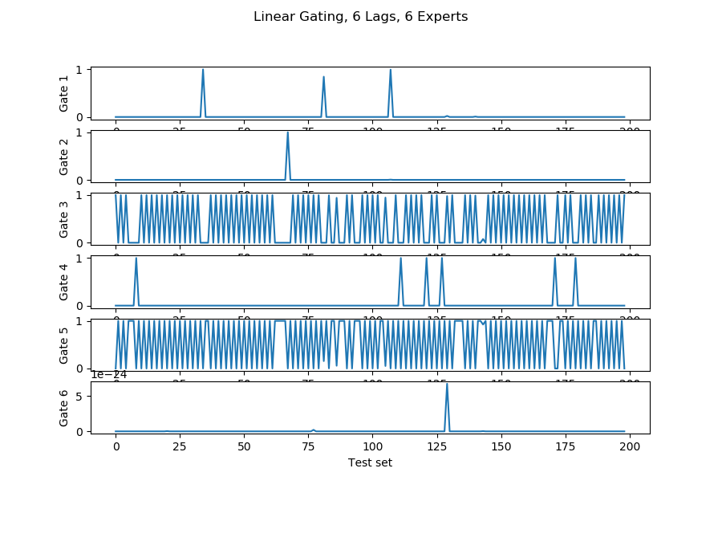
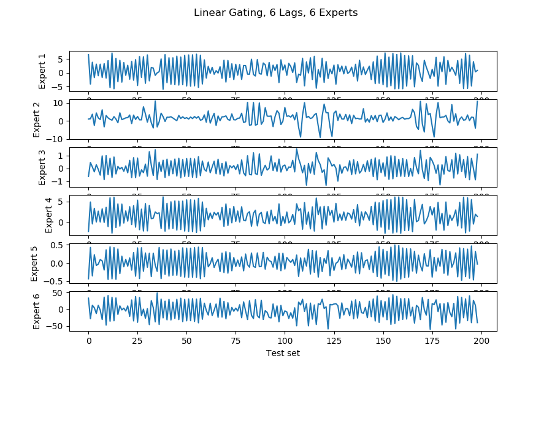
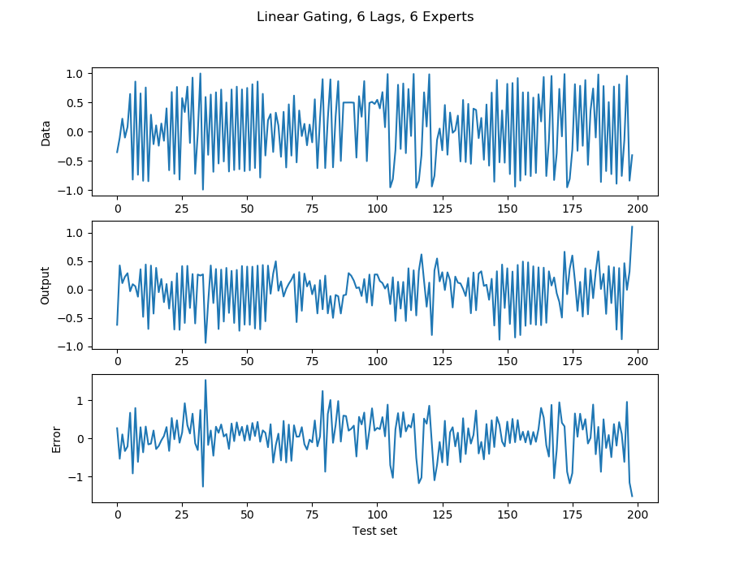
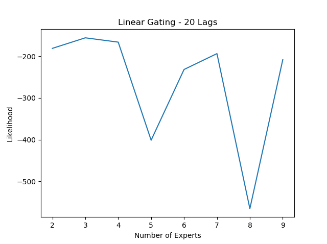
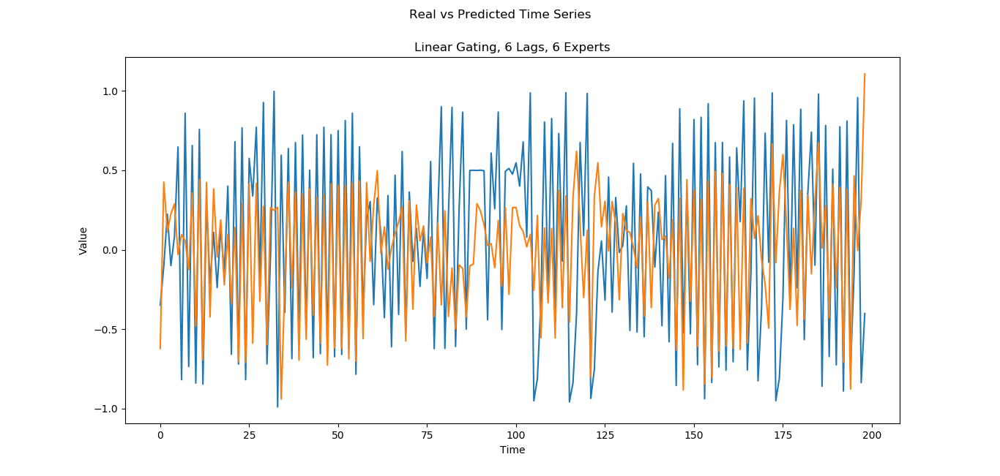

## Mixture of Experts   [](https://zenodo.org/badge/latestdoi/279084447)
 
Simple architecture with no hierarchy of experts. Contain sample code with time series dataset. The code can be adapted for classification.

Two setups:
1. Linear models for experts and gating with softmax output
1. Linear models for experts and gating with normalized gaussian output

Input: time series one step ahead
Goal:  predict new values

Main methods:
- best_lag:        Create charts to select the best lag length
- cv_experts:      Cross validation for choosing the number of experts
- final_ME:        Train and test ME

Example in the end of file.

## Usage
```
best_lag(ts, pdir):

    Create 3 plots to select best lag in time series dataset.
    
    Args:
        ts:         time series dataset
        pdir:       directory to save plots, if not empty

    Returns:
        - time series x lagged time series plot
        - correlation heatmap plot
        - correlation line chart


cv_experts(ts, lag = 20, gating = 'linear', pdir = ''):
    Select best number of experts using cross validation
    Plot the number of experts vs likelihood

     Input
        ts:         time series dataset
        lag:        time lag used to build the (x, y) dataset
        gating:     gating type 'linear' or 'gaussian'
    Output:
        best number of experts


ME(X, Yd, m = 4, gating = 'linear', add_bias = False):
    Train mixture of experts.
    
    Input
        X:          input matrix
        Yd:         desired ME output
        m:          number of experts
        add_bias:   if True, add column of ones in X matrix

    Returns
        wexp:       expert weights
        wgat:       gating weights
        var:        variance 
        alpha:      gaussian gating parameter
        gamma:      gaussian gating parameter
        sigma:      gaussian gating parameter
        
```
## Results

Sample plots.













## Reference
Lima, C.A.M 2020, *Comitê de Máquinas*, lecture notes, Universidade de Sao Paulo, delivered 2020-06-04

Lima, C.A.M 2020 *mixture* source code (version 2.0)


