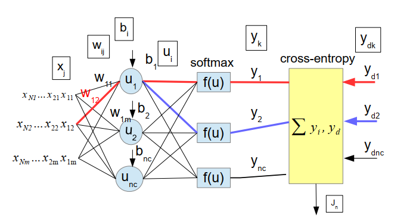
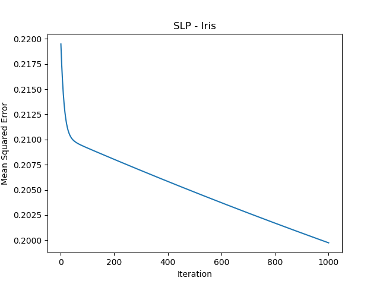
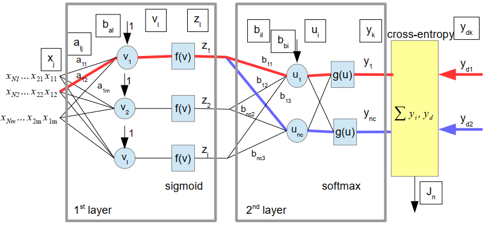
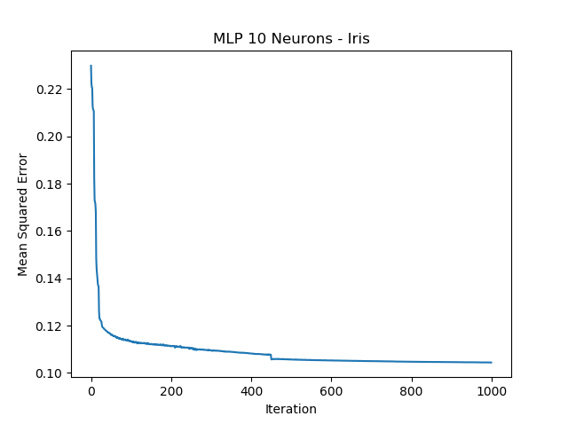

## Neural Networks
Python and NumPy implementation from scratch of simple neural networks.
- Single Layer Perceptron (SLP)
- Multi Layer Perceptron (MLP)

The training set with ***N*** elements is defined as ***D={(X1, y1), . . ., (XN, yN)}***, where ***X*** is a vector and ***y={0, 1}*** is one-hot encoded.

Sample code at the end of the file.

## SLP architecture:



- activation function: softmax
- cost function: cross entropy



### SLP Usage
```
slp_train(X_train, yd, maxiter=1000, plot=True, pdir = '',  DS_name='')
    Train single layer perceptron network.
    Architecture:
        - softmax activation function
        - cross entropy cost function
    
    Inputs
       X_train:        train set
       yd:             desired output
       plot:           plot error vs iteration
       pdir:           directory to save plot
       DS_name:        dataset name used in plot title
    
    Output
       w:              weight matrix
       
slp_predict(X_test, w)
    Predict single layer perceptron network.
    
    Input
        X_test:         test set
        w:              weights matrix
    Output
        y_hat:          predicted values
```

## MLP architecture



- 1st layer: sigmoid
- 2nd layer: softmax
- cost function: cross entropy


### MLP Features:
- Early stopping
- Variable learning rate
- Plot error vs iteration

### MLP Usage
```
mlp_train(X_train, yd, L, maxiter=1000, plot=True, pdir = '', DS_name='')
    Train multi layer perceptron network with 2 layers.
    1st layer:      sigmoid
    2nd layer:      softmax
    cost function:  cross entropy
    
    Input parameters
        X_train:    normalized train set
        yd:         desired output with 1 of n coding. yd in [0, 1]
        L:          number 1st layer neurons
        maxiter:    maximum number of iterations
        plot:       create MSE vs Iteration plot (boolean)
        pdir:       directory to save plot
        DS_name:    dataset name used in plot title
    
    Output:
        mlp:        object with weights and biases
        
 mlp_predict(X_test, mlp)
    Predict MLP values.

    Input
     X_test:    test set
     mlp:       object with weights and biases

    Output
     y_hat:     predicted values
```
## Backpropagation
The derivatives calculations are available at:  
https://github.com/vivamoto/Classifier/blob/master/Neural_Network_Derivatives.pdf
   
## Reference
Lima, C.A.M - 2020 *Redes Neurais*, lecture notes, Universidade de Sao Paulo, delivered 2020-05-07 and 2020-05-21 

[](https://zenodo.org/badge/latestdoi/279084447)

