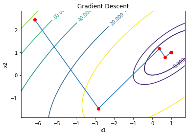
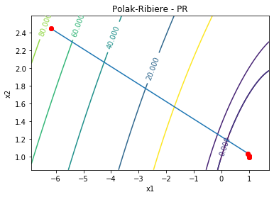

## Optimization
[](https://zenodo.org/badge/latestdoi/279084447)

Python and NumPy implementation of first and second order methods used in neural networks back propagation. 

Consider this problem:

      Min f(x1,x2) = x1^2 + 2.x2^2 - 2.x1.x2 - 2.x2

The code solves this problem using unconstrained optimization algorithms. Other equations can be included.

The methods gradient descent, Newton, Newton modified, Levenberg-Marquardt and One Step Secant are deployed in a single function for each method.

The methods Davidon-Fletcher-Powell and Broyden-Fletcher-Goldfarb-Shanno are deployed in function "quasi_newton".

The methods Hestenes-Stiefel, Polak-Ribiere and Fletcher-Reeves are deployed in function "conjugate_gradient"

Examples of usage are available at the end of the code, with random values for x1 and x2. 

There're also the example from the book "Nonlinear Programming":

      Min f(x1, x2) = (x1 - 2)^4 + (x1 - 2.x2)^2

### Sample plots



### Methods available
1. Gradient Descent
1. Bisection
1. Newton
1. Modified Newton
1. Levenberg-Marquardt
1. Quasi-Newton Methods
1. One Step Secant
1. Conjugate Gradient Methods
## Files description
- optimization.py:      Python code
- optimization.pdf:     Full description of the methods available, deployment and test results.
- optimization.Rmd:     R Markdown code to create the report.
## Usage
Include the desired objective function, derivative and hessian in the ```gradient``` method, then just call one of the available methods to get the local or global minimum.

```
gradient(x, equation = 1)
    Compute the gradient and hessian of each equation.
    
    Input:
        x:              vector with initial values x1 and x2
        equation:       1: f(x1, x2) = x1^2 + 2.x2^2 - 2.x1.x2 - 2.x2
                        2: f(x1, x2) = r1(x)**2 + r2(x)**2 (method Levenberg-Marquardt)
                        3: f(x1, x2) = (x1 - 2)^4 + (x1 - 2.x2)^2
    Output
        f, g, h:        function, gradient and hessian
```

## Reference

Lima, C. A. M., Trevisan, N. (2014) - "Aula 03 - Revisao sobre metodos de otimizacao"

M. S. Bazaraa, H. D. Sherali, C. M. Shetty. (2006) - "Nonlinear Programming - Theory and Algorithms" - 3rd edition

1994-2005 The MathWorks, Inc. - Neural Network Toolbox - http://matlab.izmiran.ru/help/toolbox/nnet/backpr11.html

